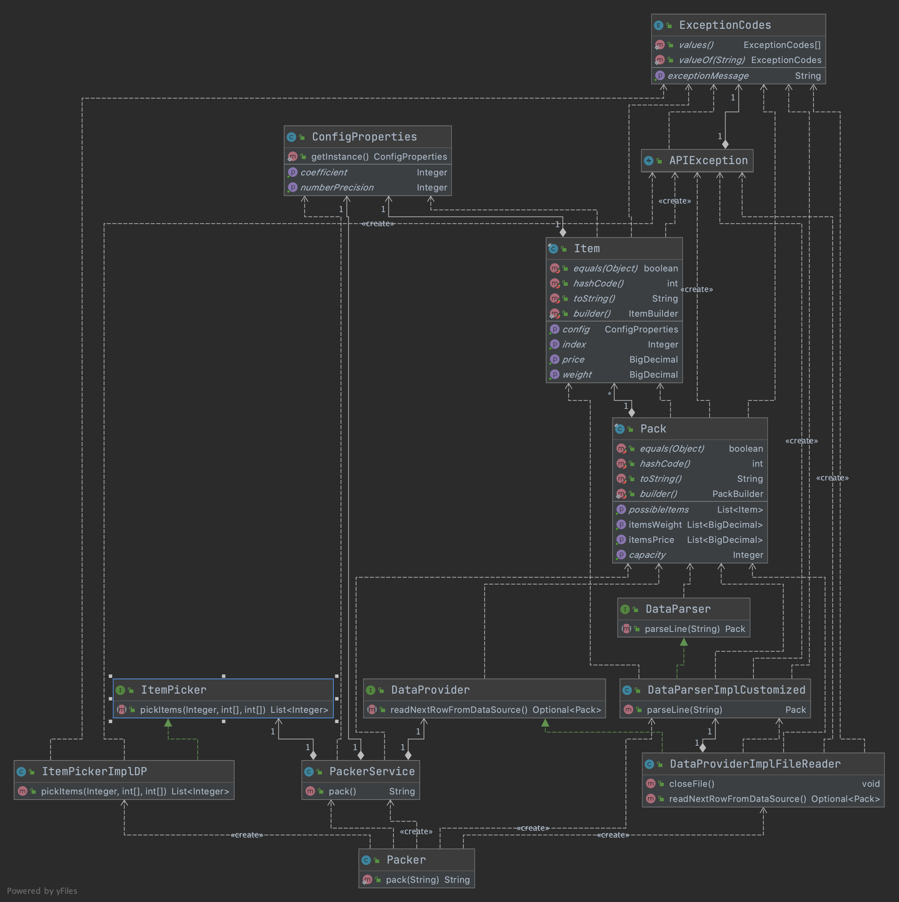

# Packer Project

A Java solution for packing items using the Knapsack Algorithm: 
There is a package with a capacity, and some items with specific weight and cost. The goal is to determine which things to put into the package so that the
total weight is less than or equal to the package limit, and the total cost is as large as possible. 

The application is developed by JAVA 11.  
This solution is meant to be used as a library (i.e. maven dependency), NOT as a standalone application.

## How to run
*1. Build the project using the below command:*

    mvn clean install 

*2. How to run tests:*

    mvn clean test

*3. Use the library:*
 
use the below static method which returns a String as a result:

    com.mobiquity.packer.Packer.pack(String filePath) 

##Design & Architecture:

The project is designed based on the OOP model trying to observe SOLID principles as much as possible. 
Each class is designed to have a Single Responsibility to have almost only one reason to change it. 
There is possibility to extend new features with extending existing modules.
The Dependency Inversion principle is used here, so that high-level modules are not dependent to low-level ones. 
They depend on the abstractions, and based on the requirements, there will be different implementation of
abstractions. Changes in implementation details are guaranteed to not affect the higher-levels.
Here you can see a perspective of the class diagram of project:

#####Configuration Properties:
In order to decrease the complexity of Knapsack algorithm, the floating-point of weight parameters
are considered fixed, and they are being ignore by multiplying to a fixed coefficient.
These variables are being read from **application.properties** file.
The library will use the caller project's properties file. Default values are set in case such file doesn't exist.

####Domain Objects:  
There are two main domain objects (POJOs) designed as immutable objects. 
The validation checks for constrains are done in the constructor of the objects.

####Repository Objects: 
The DataProvider is used as an abstract to support different Data Sources such as file, DB and so on. 
For now, the implementation is based on file data source , but there is possibility to have other implementations 
to get data from other data sources.
The same approach is used for DataParser and other classes. For now, it parses the data based on the 
customized format, but it can change to JSON,CSV,...

#####Core Algorithm:
The Knapsack 0/1 with Dynamic Programming algorithm is used to implement ItemPicker interface.

#####Packer Service:
This service plays the composition role to integrate DataProvider and ItemPicker(Knapsack Algorithm) modules.

#####Packer:
This class can be considered like initializer and loader of the whole context. The Injection 
of the dependencies are done here.

#####Testing:
There are unit tests developed by Junit 5 and Mockito, and some Integration Tests.

